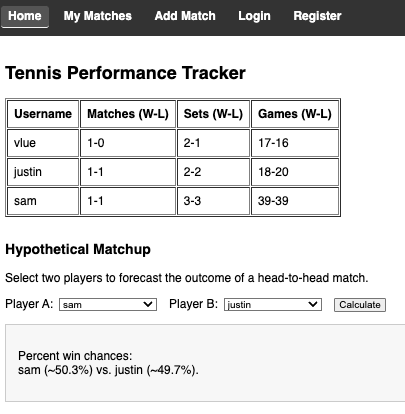

# Tennis Performance Tracker

A full-stack web application that allows users to track their tennis matches, view overall performance stats (wins, losses, sets, games), and forecast a hypothetical head-to-head outcome between any two registered players.

## Table of Contents

- [Features](#features)  
- [Tech Stack](#tech-stack)  
- [Installation](#installation)  
- [Running the App](#running-the-app)  
- [Environment Variables](#environment-variables)  
- [Project Structure](#project-structure)  
- [Homepage Display](#homepage-display)

---

## Features

- **User Authentication**  
  - Register and login with secure password hashing (bcrypt + JWT).

- **Match Management**  
  - Add new matches (date is required) with set-by-set scores (up to 3 sets).
  - View your own match history with overall stats (match record, sets won/lost, games won/lost).
  - Delete existing matches (stats update in real time).

- **Global Stats**  
  - Home page displays the stats for **all** registered users, making it easy to compare performances.

- **Hypothetical Matchup**  
  - Select two players and get a **probabilistic forecast** of who would likely win, factoring in both match record and games record (weighted 75/25).

---

## Tech Stack

- **Frontend**:  
  - [React](https://reactjs.org/) (via Create React App)  
  - [React Router](https://reactrouter.com/)  
  - Axios for API requests

- **Backend**:  
  - [Node.js](https://nodejs.org/) + [Express](https://expressjs.com/)  
  - [Mongoose](https://mongoosejs.com/) for MongoDB interactions

- **Database**:  
  - [MongoDB](https://www.mongodb.com/) (locally or hosted on MongoDB Atlas)

---

## Installation

1. **Clone** this repository:
   ```bash
   git clone https://github.com/YOUR_USERNAME/tennis-performance-tracker.git
   cd tennis-performance-tracker
2. **Install** dependencies for both the server and client
   cd server
   npm install
   cd ../client
   npm install

## Running the App
1. Start MongoDB
   - Locally (brew services start mongodb-community)
   - Or connect to remote MongoDB Atlast instance
2. Configure Environment Variables
3. Run the backend:
   cd server
   npm run dev
4. Run the frontendd:
   cd ../client
   npm start
5. Open http://localhost:3000 in your browser.
   
## Environment Variables
Create a .env file inside the server folder with something like:
MONGO_URI=mongodb://localhost:27017/tennisDB
JWT_SECRET=supersecret_jwt_key
PORT=5000

## Project Structure
```
tennis-performance-tracker/
├─ server/
│   ├─ .env                  // environment variables
│   ├─ package.json
│   ├─ server.js             // Express entry point
│   ├─ models/
│   │   ├─ User.js
│   │   └─ Match.js
│   ├─ routes/
│   │   ├─ auth.js
│   │   ├─ matches.js
│   │   └─ stats.js
│   └─ config/
│       └─ db.js             // MongoDB connection
└─ client/
    ├─ package.json
    ├─ public/
    │   └─ index.html
    └─ src/
        ├─ index.js
        ├─ App.js
        ├─ App.css           // optional styling
        ├─ api.js
        ├─ components/
        │   ├─ HomePage.js
        │   ├─ Register.js
        │   ├─ Login.js
        │   ├─ MatchList.js
        │   └─ NewMatchForm.js
        └─ ...
```
## Homepage Display


